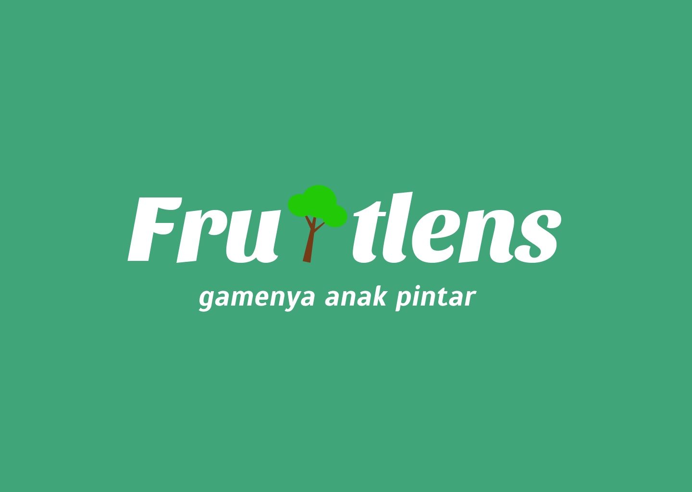

# FruitLens
“FruitLens” is an innovative mobile application designed to enhance the educational experience by providing users with a comprehensive platform for identifying and learning about fruits. Users can take pictures of fruits, and the system uses advanced image recognition technology to identify them. This application also provides detailed information about each fruit, thereby increasing users' understanding of fruits more deeply. By combining education and technology, this application makes it easier to recognize fruits and fosters curiosity and knowledge in users of all ages.

## Getting Started

These instructions will get you a copy of the project up and running on your local machine for development and testing purposes.

### Prerequisites

What things you need to install the software and how to install them:

Install and configure the Google Cloud SDK: (Assuming you have created a Google Cloud project with Firestore and storage bucket set up.)

   Download and install the Google Cloud SDK from [here](https://dl.google.com/dl/cloudsdk/channels/rapid/GoogleCloudSDKInstaller.exe).
   
   Initialize the SDK and authenticate with your Google account:
    ```bash
    gcloud init
    ```
    
   Set your Google Cloud project:
    ```bash
    gcloud config set project your-project-id
    ```

### Installing and Running

1. Clone this repository.
    ```bash
    git clone https://github.com/C241-PS232/fruitlens-api.git
    ```
2. Navigate to the project directory.
    ```bash
    cd fruitlens-api
    ```
3. Install the required dependencies.
    ```bash
    npm install
    ```
4. Set up your Firebase url and Place it in the `firebase/firebase.js` directory of your project.
5. Create a `.env` file in the root directory and add your environment variables:
    ```
    JWT_SECRET=your_jwt_secret
    ```
6. Start the application.
    ```bash
    npm start
    ```
7. Access the API at `http://localhost:8080`.

## Team Information
- **Team Members:**
  - **ML**: Indira Elza Yunita - Machine Learning Development - [caloemhood](https://github.com/caloemhood)
  - **ML**: Jauza Zahraza - Machine Learning Development - [jzahraza](https://github.com/jzahraza)
  - **ML**: Irnada Al Anati - Machine Learning Development - [irnadaaa](https://github.com/irnadaaa)
  - **CC**: Abiyyu Dhiyaul Haq - Cloud Computing - [Enotherms](https://github.com/Enotherms)
  - **CC**: Kelvin Pahotton Simamora - Cloud Computing - [kelvin77777](https://github.com/kelvin77777)
  - **MD**: Muhammad Arafie Setiawan - Mobile Development - [Arafie2603](https://github.com/Arafie2603)
  - **MD**: Dimas Nyondro Radityo - Mobile Development - [Nyondro](https://github.com/Nyondro)

## License

This project is licensed under the MIT License - see the [LICENSE.md](LICENSE) file for details

## Acknowledgments

We would like to express our gratitude to the following:
- The Bangkit 2024 Batch 1 program, for providing us the opportunity and platform to develop this project. This experience has been instrumental in our growth and learning.

- Our mentors and instructors, for their invaluable guidance and expertise. Your dedication and encouragement have inspired us to push our boundaries.

- Google Cloud Platform teams, for developing and maintaining these powerful tools that have been critical in the creation of FruitLens.

- Our users and the open-source community, for their support and contributions. Your feedback and involvement have been vital in improving FruitLens.

- Lastly, we would like to acknowledge all those who have indirectly contributed to this project. Your work has made a difference.

Thank you for your support and belief in Scancare. We look forward to continuing our journey in enhancing FruitLens through technology.
